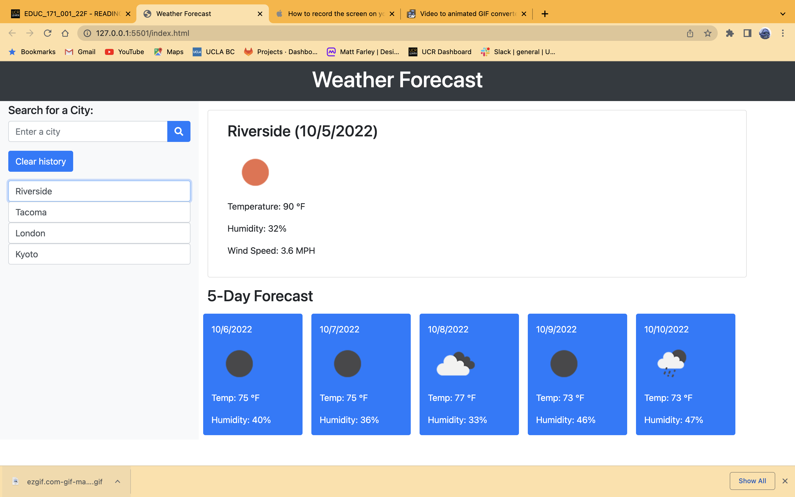
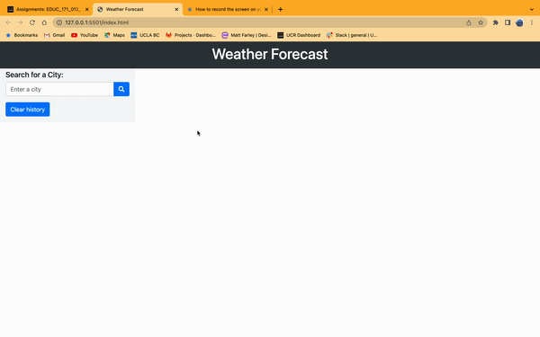

# Weather-Forecasting-JS

## Deployed Link

### Description

The application allows the user to look up a city. The application will then display the city's weather, wind speed, and a 5-day forecast.

### Usage

Type in a city name, the city name will then be saved in local storage and will allow the user to click back and forth between previous searches. 

### Features

- Weather
- Temperature
- Wind Speed
- Humidity

### Mock-Up
